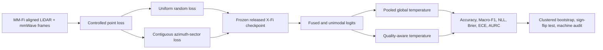
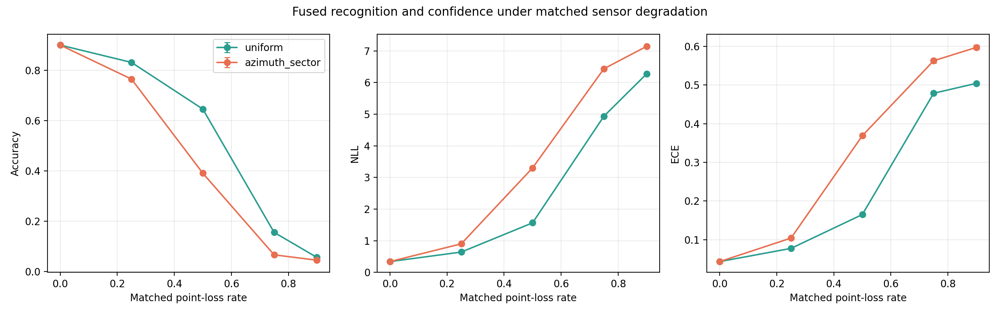
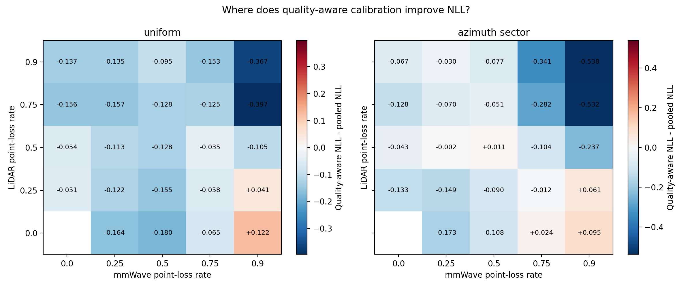
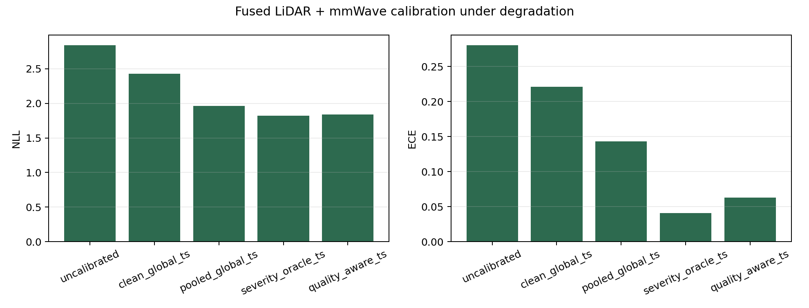

# X-Fi Multimodal Reliability Evaluation

Reproducible evaluation code and selected results for studying confidence
calibration of frozen X-Fi LiDAR-mmWave human activity recognition under
controlled sensing-quality degradation.

本仓库公开了一个基于 X-Fi 与 MM-Fi 的多模态可靠性评测流程，研究 LiDAR
与毫米波点云发生受控缺失时，冻结识别模型的置信度是否仍然可信，以及可观测
质量特征驱动的温度缩放能否改善校准。

> **Status:** research reproduction and portfolio artifact. This repository is
> not a peer-reviewed publication, does not provide clinical validation, and is
> not an official repository of the X-Fi or MM-Fi authors.

**Advisor-facing summary:**
[`One-page Research Brief (PDF)`](docs/Yiyang_Zhang_XFi_MMFi_Research_Brief.pdf)
| [`Accessible text source`](docs/research_brief_source.md)

> **Main takeaway:** observable quality cues improved confidence reliability
> under controlled LiDAR-mmWave degradation, but did not recover recognition
> Accuracy. This motivates quality-gated fusion or selective abstention rather
> than calibration alone.

## Research question

Can a deployable quality-aware scalar temperature calibrate frozen
LiDAR-mmWave predictions better than one pooled global temperature when input
point quality deteriorates?

The recognition model remains frozen. The experiment changes only the input
quality and the post-hoc confidence calibration method, which separates
**recognition robustness** from **confidence reliability**.

For the motivation, literature-to-question path, contribution, and claim
boundaries, see the bilingual
[`Research Story`](docs/research_story_bilingual.md).

## Pipeline



## Evaluated scope

| Item | Setting |
|---|---|
| Dataset | MM-Fi official random-split validation cohort |
| Model | Released X-Fi MMFi-HAR checkpoint, frozen during evaluation |
| Modalities | LiDAR and mmWave point observations |
| Target subset | 7 lower-limb actions, 15,315 aligned frames |
| Participants represented | 33 healthy volunteers |
| Post-hoc partition | 17 calibration subjects and 16 disjoint test subjects |
| Degradation | Uniform and azimuth-sector point loss |
| Formal matrix | 323 clean, degraded, fused, and unimodal conditions |
| Repetitions | 5 fixed corruption seeds |
| Primary output space | Strict 27-class X-Fi output |

The frozen protocol is recorded in
[`configs/multimodal_lower_limb_formal.yaml`](configs/multimodal_lower_limb_formal.yaml).
Its `results_pending` status is intentional: the file was frozen before the
formal run and retained unchanged as protocol evidence.

## Selected results

### Reproduction gate

Before the targeted analysis, the full 27-action clean validation cohort was
used to check the released checkpoint against the published X-Fi reference.

| Input mask | Reproduced Accuracy | Published reference | Absolute difference |
|---|---:|---:|---:|
| LiDAR + mmWave | 0.8891 | 0.887 | 0.0021 |
| LiDAR only | 0.5318 | 0.527 | 0.0048 |
| mmWave only | 0.8597 | 0.857 | 0.0027 |

All three values passed the preregistered absolute tolerance of 0.03. The
machine-readable audit reports `PASS` for 18 checks.

### Calibration under degradation

Across degraded fused test conditions, scalar calibration did not change class
predictions, so Accuracy and Macro-F1 remained 0.4821 and 0.5429 for every
calibrator. It changed the reliability of the predicted probabilities.

| Calibration method | NLL | Brier | ECE | AURC |
|---|---:|---:|---:|---:|
| Uncalibrated | 2.8550 | 0.7604 | 0.2817 | 0.3583 |
| Pooled global temperature | 1.9683 | 0.6486 | 0.1428 | 0.3552 |
| Quality-aware temperature | **1.8455** | **0.6194** | **0.0630** | **0.3495** |
| Condition-oracle temperature | 1.8261 | 0.6167 | 0.0408 | 0.3550 |

The descriptive pooled quality-aware minus pooled-global NLL difference was
`-0.122792` with a recording-cluster 95% bootstrap interval of
`[-0.147971, -0.096277]`. The two preregistered geometry-specific comparisons
also supported lower strict-27 NLL after Holm correction. These results apply
only to this controlled protocol and released checkpoint.







## Repository layout

```text
configs/             Frozen protocol and official-source metadata
docs/                Bilingual pre-analysis plan and code walkthrough
results/figures/     Selected publication-style figures
results/tables/      Selected aggregate results and machine audit
scripts/             Research-brief builder and public-release verifier
src/                 Data, corruption, inference, calibration, and audit code
tests/               Unit tests for protocol-critical components
```

Large MM-Fi data, X-Fi checkpoints, raw per-frame predictions, virtual
environments, and third-party repositories are intentionally excluded. See
[`DATA_AND_WEIGHTS.md`](DATA_AND_WEIGHTS.md) before attempting a full run.

## Quick verification

Python 3.10 was used for the formal run. Install a platform-appropriate PyTorch
build first, then the remaining dependencies:

```bash
python3.10 -m venv .venv
source .venv/bin/activate
python -m pip install --upgrade pip
# Install the PyTorch build matching your CUDA version first.
python -m pip install -r requirements.txt
python -m unittest discover -s tests -v
python scripts/verify_public_release.py
```

The unit tests validate protocol logic without downloading the full dataset.
Full GPU reproduction requires the official data, X-Fi source, and checkpoint.
See [`REPRODUCIBILITY.md`](REPRODUCIBILITY.md) for the staged workflow.

To rebuild the one-page brief from the audited aggregate results:

```bash
python -m pip install -r requirements-docs.txt
python scripts/build_research_brief.py \
  --preview docs/assets/research_brief_preview.png
```

## Interpretation boundaries

- The recordings contain healthy volunteers, not rehabilitation patients.
- Point loss is simulated in software; it is not a physical sensor-failure test.
- Only LiDAR and mmWave branches of one released checkpoint were evaluated.
- Calibration and test subjects are disjoint only within the post-hoc target
  cohort; the original action-wise recognizer split does not prove complete
  generalization to unseen users.
- Quality-aware calibration improves probability reliability; it does not make
  the frozen classifier more accurate.
- Real-time latency, hardware faults, diagnostic use, and clinical outcomes were
  not evaluated.

## Attribution and verification

MM-Fi and X-Fi remain the work of their respective authors and are cited in
[`docs/references.bib`](docs/references.bib). This repository contains an
independent evaluation layer built on their released research assets.

AI-assisted development tools supported parts of implementation and
documentation. Reported results remain tied to frozen protocols, executable
tests, machine-readable audits, and content hashes for independent inspection.

## License

Original code in this repository is released under the MIT License. MM-Fi,
X-Fi, checkpoints, and other third-party assets are not covered by this license;
their original licenses and terms continue to apply.
