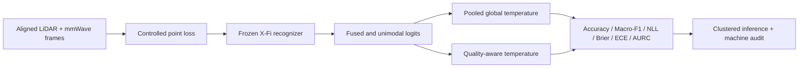

# Research Case Study

## Multimodal Perception Reliability under Sensing Degradation

### Motivation

Multimodal models can perform well when every sensor is healthy but still make
overconfident predictions when one input stream loses information. This study
separates two questions that are often conflated:

1. Does the recognizer remain accurate under degradation?
2. Does its reported confidence remain statistically reliable?

### Research question

Can an observable quality-aware temperature model calibrate the confidence of
a frozen LiDAR-mmWave recognizer better than one pooled scalar temperature
when either point modality deteriorates?

### Experimental design

| Design element | Implementation |
|---|---|
| Released research assets | MM-Fi aligned point observations and one released X-Fi checkpoint |
| Target scope | Seven lower-limb actions and 15,315 aligned frames |
| Participants represented | 33 healthy volunteers |
| Post-hoc split | 17 calibration subjects and 16 disjoint test subjects |
| Corruptions | Uniform random point loss and contiguous azimuth-sector loss |
| Formal matrix | 323 fused, unimodal, clean, and degraded conditions |
| Repetitions | Five fixed corruption seeds |
| Recognition model | Frozen throughout the experiment |

The full 27-action validation cohort was first evaluated as a reproduction
gate. The LiDAR-only, mmWave-only, and fused accuracies all fell within the
frozen absolute tolerance of the released reference before the targeted study
continued.

### Pipeline

### Main finding

Across the degraded fused test conditions, temperature scaling left class
predictions unchanged. Accuracy and Macro-F1 therefore remained fixed while
probability reliability changed.

| Method | NLL | Brier | ECE | AURC |
|---|---:|---:|---:|---:|
| Uncalibrated | 2.8550 | 0.7604 | 0.2817 | 0.3583 |
| Pooled global temperature | 1.9683 | 0.6486 | 0.1428 | 0.3552 |
| Quality-aware temperature | **1.8455** | **0.6194** | **0.0630** | **0.3495** |

The ECE reduction from 0.1428 to 0.0630 is approximately 56% relative to the
pooled global calibrator. This supports the narrower conclusion that observable
quality cues improved confidence reliability in this controlled protocol. It
does not show that calibration recovered recognition accuracy.

### Engineering and research contribution

- reproduced the released clean checkpoint behaviour before targeted analysis;
- implemented deterministic point-loss corruptions with fixed seeds;
- maintained subject-disjoint calibration and test cohorts in the target set;
- compared fused and unimodal branches under matched degradation;
- implemented scalar and quality-aware post-hoc calibration;
- retained aggregate tables, figures, tests, source hashes, and a machine audit
  while excluding restricted data, checkpoints, and raw per-frame predictions.

### Interpretation boundaries

- The recordings represent healthy volunteers, not rehabilitation patients.
- Point loss was introduced in software and is not equivalent to physical
  sensor failure.
- The conclusions apply to two point modalities and one released checkpoint.
- Calibration improved confidence estimates but not the frozen model's class
  predictions.
- The work is an independent reproducible evaluation, not a clinical study or
  a peer-reviewed publication.

### Research continuation

The strongest next step is to use calibrated uncertainty as a decision signal:
continue, re-observe, switch modality, abstain, replan, or request human review.
That extension would connect perception reliability to autonomous robot
decision-making and digital-twin safety validation.
